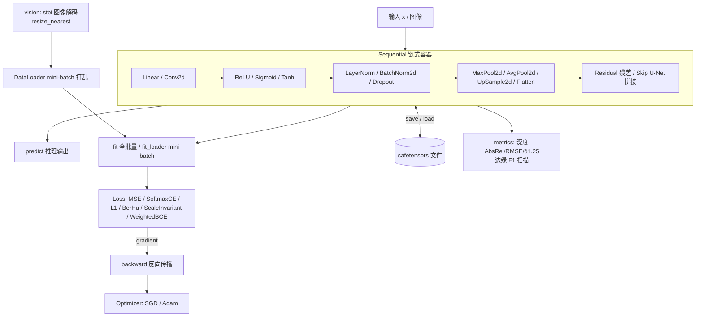

# nn

> **定位**:构建在 mlx-v 之上的**通用神经网络框架**。核心只提供与任务无关的设施:层协议(Layer sum type 的 `params/grads/set_params/forward/backward`)、优化器协议(SGD/Adam/LR 调度/梯度裁剪)、训练循环(`fit/fit_loader/train_step`)、持久化(safetensors/checkpoint 名称映射)、数据迭代(`Dataset/DataLoader`)与组合容器(`Sequential/Module/Residual/Skip`)。视觉/深度/边缘能力(vision/metrics/backbones/examples)以可选扩展形式存在,不污染内核。

反向传播采用混合策略:简单层(Linear、激活、池化)手写解析梯度,复杂层(Conv2d、LayerNorm、BatchNorm2d)通过 MLX 自动微分(`vjp`)求梯度——每类层配一个顶层 trampoline 函数绕过"闭包不能捕获实例"的 C ABI 限制。

## 结构



| 文件 | 内容 |
| --- | --- |
| `layer.v` | `Layer` sum type(15 种层)与 match 分发 |
| `linear.v` | 全连接层,Glorot 初始化,手写反向 |
| `conv2d.v` | NHWC 卷积层,He 初始化,vjp 自动微分反向 |
| `activations.v` | `ReLU`、`Sigmoid`、`Tanh` |
| `pool.v` | `MaxPool2d`、`AvgPool2d`、`GlobalAvgPool2d`、`UpSample2d`(reshape/广播实现) |
| `norm.v` | `LayerNorm`、`BatchNorm2d`(vjp 反向,BN 带 running 统计与 train/eval) |
| `dropout.v` | inverted `Dropout`,train/eval 感知 |
| `container.v` | `Flatten`、`Residual`(加法跳跃)、`Skip`(通道拼接跳跃) |
| `loss.v` | `Loss` sum type:MSE / SoftmaxCE / L1 / BerHu / ScaleInvariant / WeightedBCE |
| `optimizer.v` | `Optimizer` sum type:`SGD`、`Adam`(偏差校正矩估计) |
| `data.v` | `Dataset` + `DataLoader`(打乱、mini-batch、take_axis 取批) |
| `vision.v` | `load_image`(stbi 解码 PNG/JPEG → NHWC [0,1])、`save_image`(PNG 输出)、`stack_images`、`resize_nearest`、`flip_horizontal`(水平翻转增强) |
| `checkpoint.v` | 预训练 checkpoint 加载:safetensors 头解析(键/形状清单)、`LoadRule` 名称映射、PyTorch 布局转换(`torch_conv_rule` perm [0,2,3,1]、`torch_linear_rule` perm [1,0])、1-D 偏置自动 reshape |
| `metrics.v` | 深度指标 `depth_metrics`、边缘指标 `edge_metrics`(F1 阈值扫描) |
| `sequential.v` | `Sequential`:`forward`/`forward_taps`/`backward`/`fit`/`fit_loader`/`train_step`/`predict`/`save`/`load`/`load_map`/`load_checkpoint`/`set_training`/`use_scheduler`/`grad 范数日志`/`to_dtype` |
| `module.v` | `Module` 组合容器:`add`、`named_parameters()`(点分名)、嵌套 + 协议递归 |
| `sequence.v` | `Attention`(多头自注意力,可选因果掩码)、`LSTM`(vjp trampoline 反向) |
| `conv1d3d.v` | `Conv1d`/`Conv3d` 层(vjp 反向,同 Conv2d 模式) |
| `groupnorm.v` | `GroupNorm`(分组归一,vjp 反向) |
| `gradstats.v` | 全局梯度范数 + 裁剪系数(集成进 SGD/Adam 的 `clip_norm`) |
| `backbones.v` | 架构预设:`vgg16_lite`、`resnet18_lite`、`hed_unet` |
| `optimizer.v` | `Optimizer`:`SGD`/`Adam`(偏差校正、`clip_norm` 裁剪)、`LRScheduler`(`StepLR`/`CosineLR`)、Adam 状态 save/load |
| `clifford.v` | 标量/rotor/motor 表示竞技场:`CliffordLinear`(自由 multivector 线性层)、`GroupLayer`(指数映射参数化的单位 rotor/motor 共轭层)、`ReprSwitch`(表示间保值嵌入);统一乘法表驱动,`repr` 字段切换维度 1/4/8 |
| `motor.v` | `MotorGroupLayer`:写死 SE(3) 的生产版 group 层——原始四元数归一化参数化(无指数映射奇异性),**解析梯度**(无 vjp/乘法表),点作用 `1+εP ↦ 1+ε(RP+t)` |
| `nn_test.v` | 有限差分梯度校验(Conv2d/Linear)、形状与梯度守恒冒烟测试 |
| `clifford_test.v` | Clifford 乘法表(四元数/对偶四元数)、CliffordLinear 有限差分梯度、rotor 旋转与 motor 点作用几何正确性、ReprSwitch 数量保真 |

## 用法

```v
import mlx
import nn

// 组网(视觉 CNN,NHWC)
mut net := nn.Sequential{}
net.add(nn.new_conv2d(1, 8, 3, 1, 1, 11))
net.add(nn.ReLU{})
net.add(nn.new_residual([nn.Layer(nn.new_conv2d(8, 8, 3, 1, 1, 12)), nn.Layer(nn.ReLU{})]))
net.add(nn.new_max_pool2d(2))
net.add(nn.new_conv2d(8, 16, 3, 1, 1, 13))
net.add(nn.ReLU{})
net.add(nn.new_upsample2d(2))
net.add(nn.new_conv2d(16, 1, 3, 1, 1, 14))
net.add(nn.Sigmoid{})

// mini-batch 训练
mut dl := nn.new_dataloader(nn.Dataset{ x: images, y: edges }, 16, true)
mut criterion := nn.Loss(nn.WeightedBCELoss{ w_pos: 2.0 })
mut opt := nn.Optimizer(nn.Adam{ lr: 0.01 })
net.fit_loader(mut dl, mut criterion, mut opt, 200, 40)

// 推理与评估
net.set_training(false)
pred := net.predict(test_x)
println(nn.edge_metrics(pred, test_y))

// 加载 PyTorch 风格预训练 checkpoint(名称映射 + NCHW→NHWC 布局转换)
mut ckpt := nn.open_checkpoint('vgg16.safetensors')
defer { ckpt.close() }
println(ckpt.keys())  // 检查可用张量名
net.load_checkpoint(ckpt, [
	nn.torch_conv_rule('features.0.weight', 'layers.0.w'),
	nn.plain_rule('features.0.bias', 'layers.0.b'),
	// ...
])

// HED/FPN 风格的中间层输出
taps := net.forward_taps(x, [4, 9, 13])

// 权重持久化
net.save('model.safetensors')
net.load('model.safetensors')
```

## 运行示例与测试

```sh
v run examples/xor          # MLP 学 XOR:loss 0.28 -> 2e-4,权重保存/重载一致
v run examples/edge_filter  # CNN 学 Sobel 边缘:边缘 F1 0.22 -> 0.97
v run examples/pretrained   # PyTorch 风格 checkpoint 加载,逐位一致
v run examples/clifford   # 标量/rotor/motor 复合层训练 + 保存/加载回放
v run examples/bsds_hed     # 真实任务:BSDS500 边缘似然估计(见下)
v test .                    # 有限差分梯度校验 + 形状冒烟
```

## 真实任务示例:BSDS500 边缘似然估计

`examples/bsds_hed` 用两级 U-Net(`Skip` 容器嵌套)+ `WeightedBCELoss` 在 BSDS500 上从零训练:

- 数据:BDS500 原图(stbi 读 JPG)+ 多标注者边界均值作软标签(.mat 一次性转 .npy,`mlx.load` 直读);横竖版混合的图统一 `resize_nearest` 到 240×320;水平翻转增强(仅训练集)。
- 训练:Adam(lr 3e-3)、w_pos=12、batch 4、40 epoch,Metal GPU 上约 15 分钟。
- 结果:val(24 张)F1@0.5 从 0.003 → ~0.08-0.10,bestF1 ~0.17-0.20(无 NMS 的粗指标;HED 论文用预训练 VGG + 多尺度融合为 0.78 ODS)。预测边缘图存到 `data/predictions/` 可目视检查:主体轮廓(人物、车辆、建筑)清晰可辨。
- 数据集不入库:`data/` 和 `*.safetensors` 已 gitignore;重放请下载 [BIDS/BSDS500](https://github.com/BIDS/BSDS500) 并运行标注转换(见 examples/bsds_hed 源码注释)。

## 已知约束(当前 V 0.5.2)

- 本版本 V 编译器存在解析 bug(已报 [vlang/v#28339](https://github.com/vlang/v/issues/28339)):**入口 `module main` 文件里不能声明任何方法**,否则 import 含 C 指令的模块(mlx)时报 `expecting type declaration`。逻辑全部写在 `module nn`(被 import 的依赖模块)里即可完全规避;框架内部因此用 sum type + match 代替 interface,方法统一 `mut` 接收者。新增层类型时在 `layer.v` 的 sum type 和各 match 分支注册。
- safetensors 惰性加载在 GPU 上未实现;mlx-v 的 load 已固定在 CPU stream 上物化,对调用方透明。
- 若编译时偶发 `v3 compiler memory usage ...` 报错,加 `-no-memory-limit` 重试。

## 路线图

- [x] 卷积/转置卷积底层包装(mlx-v `conv.v`)
- [x] Conv2d(vjp 反向)+ Adam
- [x] 图像数据管线(stbi 解码、mini-batch DataLoader)
- [x] Pooling/Upsample/Norm/Dropout + train/eval 模式
- [x] Residual/Skip 容器、视觉损失库、深度/边缘指标
- [x] 预训练 checkpoint 加载:safetensors 头解析、LoadRule 名称映射、PyTorch 布局转换(examples/pretrained 逐位一致验证)
- [ ] 开箱即用的骨干架构预设(VGG16/HED 积木 + 公开权重命名表)
