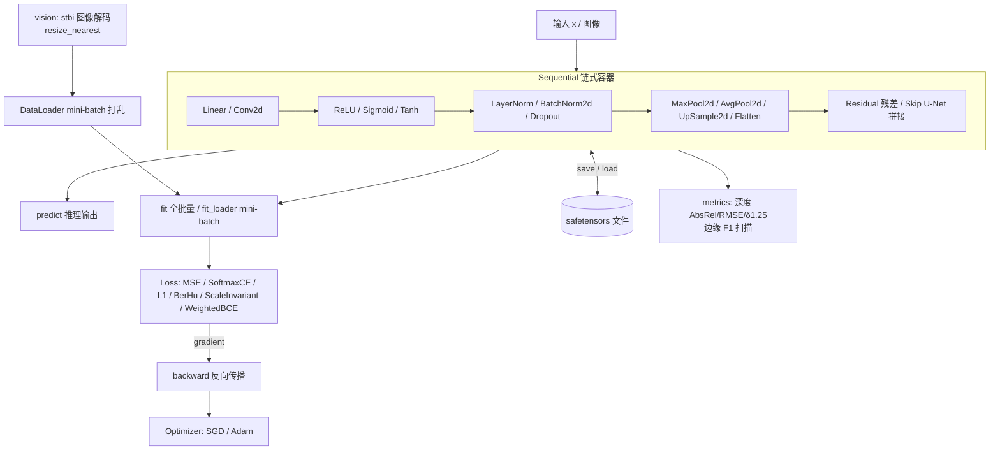

# nn

基于 [mlx-v](../mlx-v)(Apple MLX 的 V 语言绑定)搭建的最小神经网络训练与推理框架,纯 V 面向对象实现,支持稠密(MPL)与视觉(CNN)任务,权重用 safetensors 格式持久化。

反向传播采用混合策略:简单层(Linear、激活、池化)手写解析梯度,复杂层(Conv2d、LayerNorm、BatchNorm2d)通过 MLX 自动微分(`vjp`)求梯度——每类层配一个顶层 trampoline 函数绕过"闭包不能捕获实例"的 C ABI 限制。

## 结构



| 文件 | 内容 |
| --- | --- |
| `layer.v` | `Layer` sum type(15 种层)与 match 分发 |
| `linear.v` | 全连接层,Glorot 初始化,手写反向 |
| `conv2d.v` | NHWC 卷积层,He 初始化,vjp 自动微分反向 |
| `activations.v` | `ReLU`、`Sigmoid`、`Tanh` |
| `pool.v` | `MaxPool2d`、`AvgPool2d`、`GlobalAvgPool2d`、`UpSample2d`(reshape/广播实现) |
| `norm.v` | `LayerNorm`、`BatchNorm2d`(vjp 反向,BN 带 running 统计与 train/eval) |
| `dropout.v` | inverted `Dropout`,train/eval 感知 |
| `container.v` | `Flatten`、`Residual`(加法跳跃)、`Skip`(通道拼接跳跃) |
| `loss.v` | `Loss` sum type:MSE / SoftmaxCE / L1 / BerHu / ScaleInvariant / WeightedBCE |
| `optimizer.v` | `Optimizer` sum type:`SGD`、`Adam`(偏差校正矩估计) |
| `data.v` | `Dataset` + `DataLoader`(打乱、mini-batch、take_axis 取批) |
| `vision.v` | `load_image`(stbi 解码 PNG/JPEG → NHWC [0,1])、`stack_images`、`resize_nearest` |
| `metrics.v` | 深度指标 `depth_metrics`、边缘指标 `edge_metrics`(F1 阈值扫描) |
| `sequential.v` | `Sequential`:`forward`/`backward`/`fit`/`fit_loader`/`train_step`/`predict`/`save`/`load`/`set_training` |
| `nn_test.v` | 有限差分梯度校验(Conv2d/Linear)、形状与梯度守恒冒烟测试 |

## 用法

```v
import mlx
import nn

// 组网(视觉 CNN,NHWC)
mut net := nn.Sequential{}
net.add(nn.new_conv2d(1, 8, 3, 1, 1, 11))
net.add(nn.ReLU{})
net.add(nn.new_residual([nn.Layer(nn.new_conv2d(8, 8, 3, 1, 1, 12)), nn.Layer(nn.ReLU{})]))
net.add(nn.new_max_pool2d(2))
net.add(nn.new_conv2d(8, 16, 3, 1, 1, 13))
net.add(nn.ReLU{})
net.add(nn.new_upsample2d(2))
net.add(nn.new_conv2d(16, 1, 3, 1, 1, 14))
net.add(nn.Sigmoid{})

// mini-batch 训练
mut dl := nn.new_dataloader(nn.Dataset{ x: images, y: edges }, 16, true)
mut criterion := nn.Loss(nn.WeightedBCELoss{ w_pos: 2.0 })
mut opt := nn.Optimizer(nn.Adam{ lr: 0.01 })
net.fit_loader(mut dl, mut criterion, mut opt, 200, 40)

// 推理与评估
net.set_training(false)
pred := net.predict(test_x)
println(nn.edge_metrics(pred, test_y))

// 权重持久化
net.save('model.safetensors')
net.load('model.safetensors')
```

## 运行示例与测试

```sh
v run examples/xor          # MLP 学 XOR:loss 0.28 -> 2e-4,权重保存/重载一致
v run examples/edge_filter  # CNN 学 Sobel 边缘:边缘 F1 0.22 -> 0.97
v test .                    # 有限差分梯度校验 + 形状冒烟
```

## 已知约束(当前 V 0.5.2)

- 本版本 V 编译器存在解析 bug(已报 [vlang/v#28339](https://github.com/vlang/v/issues/28339)):**入口 `module main` 文件里不能声明任何方法**,否则 import 含 C 指令的模块(mlx)时报 `expecting type declaration`。逻辑全部写在 `module nn`(被 import 的依赖模块)里即可完全规避;框架内部因此用 sum type + match 代替 interface,方法统一 `mut` 接收者。新增层类型时在 `layer.v` 的 sum type 和各 match 分支注册。
- safetensors 惰性加载在 GPU 上未实现;mlx-v 的 load 已固定在 CPU stream 上物化,对调用方透明。
- 若编译时偶发 `v3 compiler memory usage ...` 报错,加 `-no-memory-limit` 重试。

## 路线图

- [x] 卷积/转置卷积底层包装(mlx-v `conv.v`)
- [x] Conv2d(vjp 反向)+ Adam
- [x] 图像数据管线(stbi 解码、mini-batch DataLoader)
- [x] Pooling/Upsample/Norm/Dropout + train/eval 模式
- [x] Residual/Skip 容器、视觉损失库、深度/边缘指标
- [ ] 预训练骨干加载(HF safetensors 名称映射, MiDaS/DPT/HED 风格架构)
